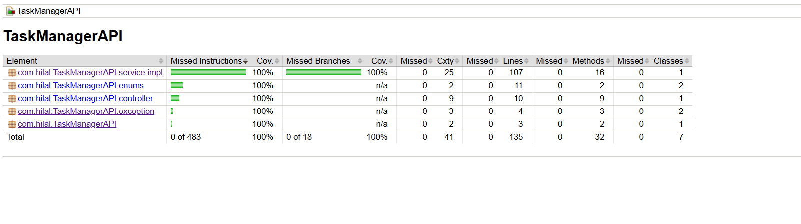
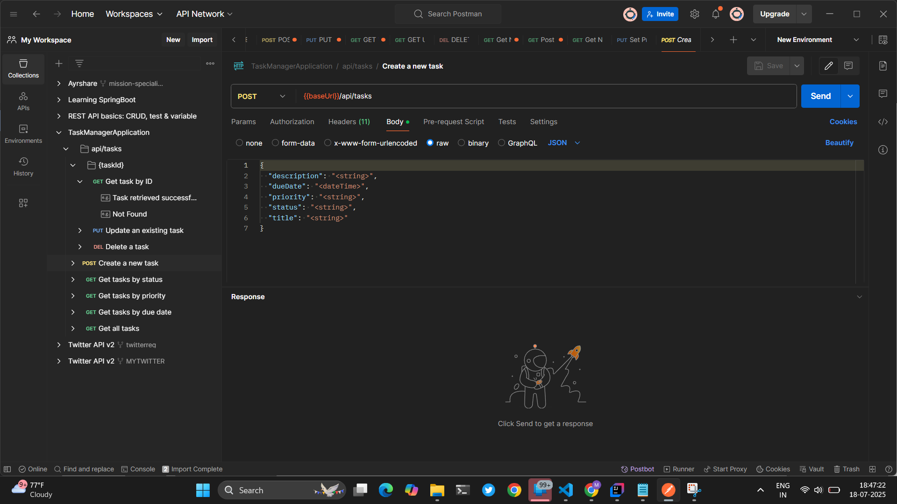

# 📝 Task Management API – Spring Boot Hands-On Assignment

A simple RESTful Task Management API built using Spring Boot, Spring Data JPA, H2 Database, and Bean Validation. This application allows users to manage tasks with features like creating, updating, viewing, and deleting tasks.

---

## 📁 Project Structure

```
src/main/java/com/hilal/taskmanager/
├── TaskManagerApplication.java
├── controller/
│   └── TaskController.java
├── entity/
│   └── Task.java
├── repository/
│   └── TaskRepository.java
├── service/
│   └── TaskService.java
├── dto/
│   ├── TaskRequestDto.java
│   └── TaskResponseDto.java
├── exception/
│   ├── TaskNotFoundException.java
│   └── GlobalExceptionHandler.java
└── enums/
    ├── TaskStatus.java
    └── Priority.java

src/test/java/com/hilal/taskmanager/
├── controller/
│   └── TaskControllerTest.java
├── repository/
│   └── TaskRepositoryTest.java
└── TaskManagerApplicationTests.java
```

---

## 🚀 Getting Started

### ✅ Prerequisites

- Java 24
- Gradle
- IDE (IntelliJ recommended)

### 📦 Run Locally

1. Clone the repository:
   ```bash
   git clone https://github.com/yourusername/task-manager-api.git
   cd task-manager-api
   ```

2. Run the application:
   ```bash
   ./gradlew bootRun
   ```

3. Access the H2 Database Console:
   ```
   http://localhost:8080/h2-console
   ```

4. Access Swagger UI for API Testing (once running):
   ```
   http://localhost:8080/swagger-ui/index.html
   ```

---

## ⚙️ Configuration

`src/main/resources/application.properties`

```properties
# Database Configuration
spring.datasource.url=jdbc:h2:mem:testdb
spring.datasource.driverClassName=org.h2.Driver
spring.jpa.hibernate.ddl-auto=create-drop
spring.h2.console.enabled=true

# Logging
logging.level.com.hilal.taskmanager=DEBUG
```

---

## 📘 API Documentation

> 📌 **Swagger UI is used for API documentation and testing.**
>
> 🔗 [Swagger UI](http://localhost:8080/swagger-ui/index.html)
>[SwaggerAPIDoc.yaml](SwaggerAPIDoc.yaml)
> 🧾 

---


## 📌 API Endpoints Summary

### 🟢 Create Task
- POST `/api/tasks`

### 🟡 Update Task
- PATCH `/api/tasks/{taskId}`

### 🔴 Delete Task
- DELETE `/api/tasks/{taskId}`

### 🔍 Get Task by ID
- GET `/api/tasks/{taskId}`

### 📋 Get All Tasks
- GET `/api/tasks/all`

### 📊 Get Tasks by Status
- GET `/api/tasks/status/{status}`

### 🏷 Get Tasks by Priority
- GET `/api/tasks/priority/{priority}`

### 📆 Get Tasks by Due Date
- GET `/api/tasks/dueDate/{dueDate}`

[ApiDetails.md](ApiDetails.md)
---

## 🧪 Test Results

- ✅ All unit tests and integration tests are passing.
- 🧾 _[TestReport](TestReport)_
- 📸 __

---

## 💡 Features

- ✅ Create, update, delete, and view tasks
- ✅ Enum-based status and priority
- ✅ Validation and exception handling
- ✅ Swagger UI and H2 in-memory DB
- ✅ DTO-based API design
- ✅ Unit and integration tests

---

## 📚 Resources & Tools Used

- Spring Boot
- Spring Data JPA
- Hibernate Validator (JSR-380)
- Swagger (SpringDoc OpenAPI)
- H2 Database
- JUnit 5, Mockito
- Postman / curl

---

## 📬 Contact

For any questions or feedback, feel free to reach out:  
📧 hilalsidhic21@gmail.com
🔗 [Github](https://github.com/hilalsidhic) 

---
